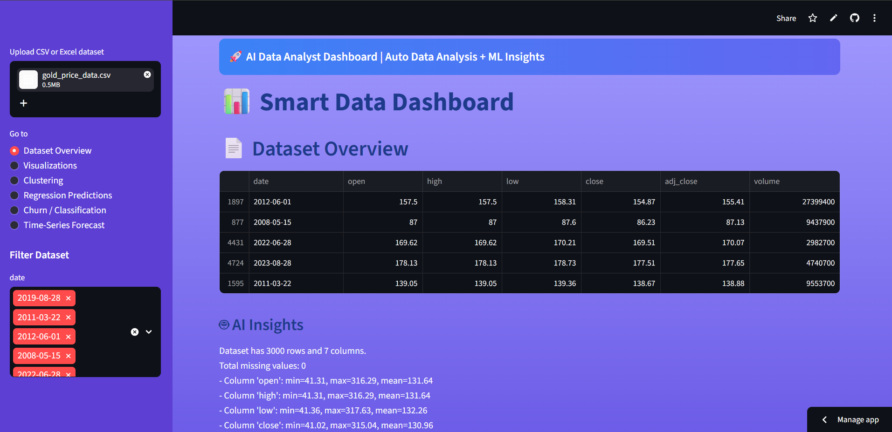
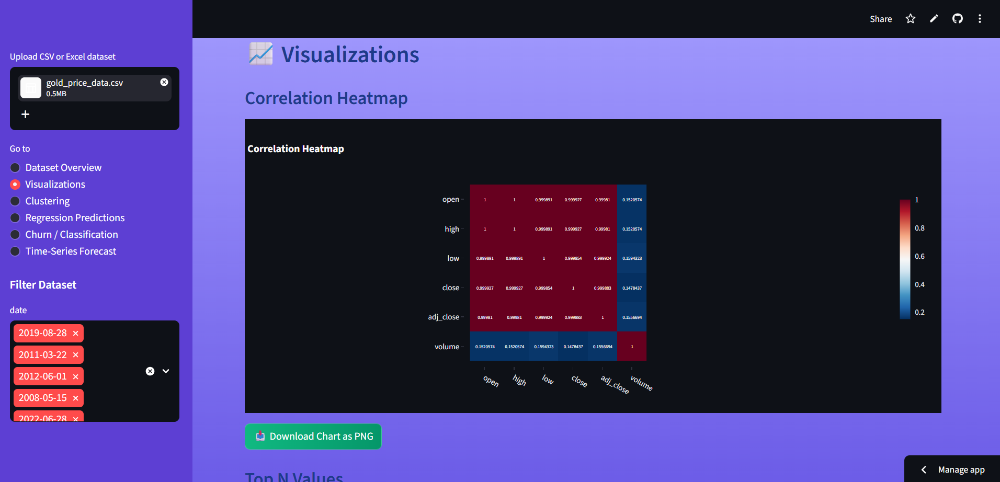
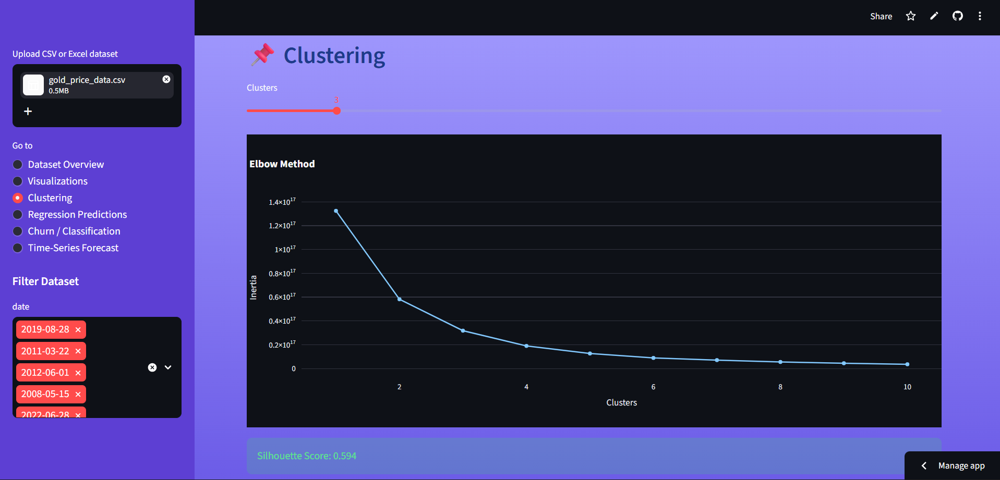
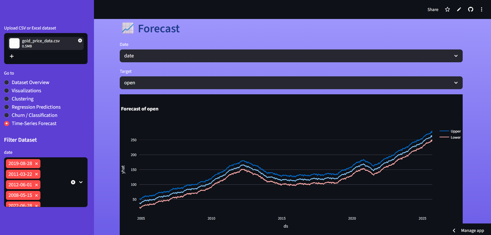

## 🥇 AI-Powered Data Analyst Dashboard with Automated Insights & Machine Learning

# 🚀 AI Data Analyst Dashboard

An intelligent and interactive **AI-powered data analysis dashboard** built using Streamlit.  
This tool automatically analyzes datasets, generates insights, and applies machine learning models — all in one place.

---

## 📌 Project Overview

The **AI Data Analyst Dashboard** is designed to simplify data analysis by automating:

- Data cleaning & preprocessing
- Exploratory Data Analysis (EDA)
- Data visualization
- Machine Learning predictions
- NLP & sentiment analysis

It works like a **mini Power BI + AI system**, allowing users to upload any dataset and instantly get insights.

---

# 🌐 Live Demo: 
https://ai-data-analyst-dashboard-ptkymvsappfff8pvytclvqo.streamlit.app/

## Features
# 1. Dataset Overview
- View uploaded dataset in a clean tabular format.
- Detect numeric, categorical, date, and text columns.
- Filter data dynamically using sidebar filters.
- Auto-generated AI insights for quick understanding.
  
# 2. Key Metrics (KPI Cards)
- Total Records
- Number of Numeric Columns
- Number of Categorical Columns
- Number of Date Columns
- Premium styled KPI cards for quick insights
  
# 3. Visualizations
- Interactive histograms, scatter plots, correlation heatmaps.
- Top N values charts for numeric columns.
- Optional download for charts as PNG.

  
# 4. Clustering
- KMeans clustering with selectable number of clusters.
- Elbow method visualization for optimal cluster selection.
- Silhouette score for cluster quality evaluation.
  
# 5. Regression Predictions
- Linear regression predictions for numeric targets.
- Actual vs Predicted charts.
- Evaluation metrics display (R², RMSE, etc.)

  
# 6. Classification / Churn Prediction
- Classify categorical targets using AI models.
- Feature importance bar charts.
- Actual vs Predicted preview table.
  
# 7. Time-Series Forecasting
- Forecast numeric columns over time.
- Works with detected date columns.
- Plotly interactive forecast charts.
  
# 8. Text / NLP Analysis
- WordCloud generation for text data.
- Sentiment analysis with TextBlob.
- Bar charts for positive, negative, neutral sentiments.

## 🛠️ Tech Stack

- **Frontend:** Streamlit  
- **Backend:** Python  
- **Libraries:**
  - Pandas, NumPy
  - Matplotlib, Plotly
  - Scikit-learn
  - TextBlob (NLP)
  - WordCloud
  - Prophet (Time-Series)

---

## 📂 Project Structure
| **File / Module**   | **Description**                             |
| ------------------- | ------------------------------------------- |
| `app.py`            | Main Streamlit application                  |
| `requirements.txt`  | List of required Python packages            |
| `data_analysis.py`  | Functions for loading and cleaning datasets |
| `visualization.py`  | Functions for creating plots and charts     |
| `clustering.py`     | KMeans clustering and related functions     |
| `ml_models.py`      | Regression machine learning models          |
| `classification.py` | Classification / Churn prediction models    |
| `insight.py`        | Functions to generate AI insights           |
| `README.md`         | Project documentation and instructions      |

## 📸 Screenshots

